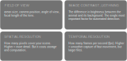
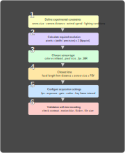
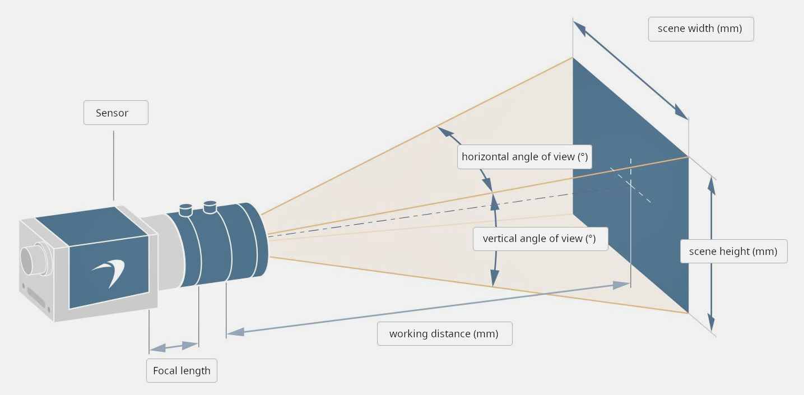

# Video Capture Setup for Behavioral Experiments
 
**A practical guide for life-science researchers** — from first principles to hardware selection, compression strategies, and illumination choices.
 


 
> **Who this is for:** Researchers in behavioral neuroscience, ecotoxicology, and ethology who need to record and analyze animal behavior automatically. No prior imaging or electronics expertise is assumed. Equations are included for those who want to go deeper — skip them freely.
 
---

## Table of Contents

1. [Introduction](#introduction)
2. [Choosing the Right Tool](#choosing-the-right-tool)
3. [Camera Configuration Guidelines](#camera-configuration-guidelines)
  - [Connectivity](#connectivity)
  - [Sensor Resolution and Optics](#sensor-resolution-and-optics)
  - [Lens Selection](#lens-selection)
  - [Frame Rate and Exposure Time](#frame-rate-and-exposure-time)
  - [Lighting](#lighting)
4. [Compression Strategies](#compression-strategies)
  - [Codecs and Containers](#codecs-and-containers)
  - [Key Frames and Artifacts](#key-frames-and-artifacts)
5. [Practical Tools and Code](#practical-tools-and-code)
6. [Troubleshooting](#troubleshooting)
7. [References](#references)

---

## Introduction
The quality of video data in scientific experiments depends heavily on **experimental conditions** such as:




**Why it matters**: Poorly configured setups can introduce biases, artifacts, or loss of critical data, especially in behavioral studies. Additionally, parameters like resolution, frame rate, and compression directly impact **computational costs** for downstream analysis (e.g., pose estimation, tracking).

This guide bridges the gap between **scientific requirements** and **technical implementation**, with a focus on:  
✅ **Accessibility** for non-technical researchers  
✅ **Rigorous** experimental standards  
✅ **Actionable** advice for hardware/software selection

Below we outline some concepts that are critical for successful implementation of digital video recording.

---

## 🛠️ Choosing the Right Tool
<p align="justify">
There are countless relevant video capture solutions available, of all qualities and at all prices, whether it be a consumer camera, security camera, action cam (such as a GoPro), or electronic device embeded camera (such as a Raspberry Pi). Each of these solutions has its pro and cons.
In the context of experimental laboratory systems, it is more convenient to use a camera connected to a computer, which will facilitate control, synchronization, and data storage. Modern industry USB cameras can be very good options for laboratories that are well versed in prototyping, programming, and software control layers. 
</p>



### Step 1: Define Experimental Constraints

Before selecting a camera, answer these questions (to define the experimental conditions):


| **Parameter**       | **Example Values**           | **Impact**                                                                     |
| ------------------- | ---------------------------- | ------------------------------------------------------------------------------ |
| Field of View (FoV) | 25 cm (arena width)          | Determines required resolution (e.g., 1 mm/pixel → 250 pixels width).          |
| Camera Distance     | 50 cm from subject           | Affects lens choice (focal length, working distance).                          |
| Spatial Resolution  | 1 mm/pixel or better         | Nyquist theorem: Double the minimum (e.g., 500 pixels for 25 cm FoV).          |
| Speed of Action     | 8 cm/s (open field) → 30 fps | Faster movements require higher fps (e.g., 200 fps for treadmill at 150 cm/s). |
| Lighting Conditions | <100 lux (low light) or IR   | Guides sensor sensitivity (pixel size, ISO, IR filter).                        |

 
(Lens Selector Basler AG : https://www.baslerweb.com/fr-fr/tools/lens-selector/)

> **💡 Rule of Thumb**: Use the **Nyquist criterion** to avoid aliasing. If your smallest feature is *X* mm, ensure at least *2X* pixels across it.

### Step 2: Camera Types and Use Cases


| **Type**               | **Pros**                        | **Cons**                              | **Best For**                          |
| ---------------------- | ------------------------------- | ------------------------------------- | ------------------------------------- |
| **Consumer Camera**    | Cheap, easy to use              | Limited control, poor synchronization | Pilot studies, low-budget setups      |
| **Security Camera**    | IR support, long-term recording | Fixed settings, low resolution        | Overnight experiments, IR lighting    |
| **Action Cam (GoPro)** | Portable, high fps              | Wide-angle distortion, no API control | Field studies, mobile setups          |
| **USB Camera**         | Plug-and-play, software control | Bandwidth limits (USB 2.0/3.0)        | Lab setups with computer control      |
| **GigE Camera**        | Long cable (100m), reliable     | Requires PoE or separate power        | Distributed systems, high resolution  |
| **CameraLink**         | Ultra-high throughput (6 Gbps)  | Expensive, short cable (10m)          | High-speed, high-resolution recording |
| **Embedded (RPi)**     | Low cost, customizable          | Limited processing power              | DIY setups, remote monitoring         |


### Step 3: Connection Type


| **Interface** | **Max Throughput** | **Max Cable Length**       | **Power Over Cable?** | **Cost**  | **Use Case**                       |
| ------------- | ------------------ | -------------------------- | --------------------- | --------- | ---------------------------------- |
| USB 2.0       | 480 Mbps           | 5 m                        | ❌ No                  | Low       | Low-res, low-fps setups            |
| USB 3.0       | 5 Gbps             | 5 m (10 m with repeater)   | ❌ No                  | Medium    | HD (1080p) at 30–60 fps            |
| GigE          | 1 Gbps             | 100 m                      | ✅ Yes (PoE)           | Low       | Long-distance, multi-camera setups |
| CameraLink    | 6 Gbps             | 10 m                       | ❌ No                  | High      | High-speed (200+ fps), high-res    |
| CoaXPress     | 6.25 Gbps          | 40 m (100 m with extender) | ❌ No                  | Very High | Industrial, ultra-high bandwidth   |


> **⚠️ Note**: For **USB 3.0**, use **shielded cables** and avoid hubs to prevent bandwidth bottlenecks.

---

## 📷 Camera Configuration Guidelines
<p align="justify">
To obtain biometric behavioral data, digital video files have to be initially recorded. Digital video is spatial and temporal sampled frames presented in a sequence. The spatio-temporal sampling unit which is usually called pixel (picture element) can be represented by a digital value to describe its color and brightness. 
A good quality video is made up of images that are large enough to be clearly legible, sufficiently resolved to be precise, and sharp in both still and moving areas, with good contrast, while remaining rich in information. In other words, we need sufficient definition so that objects are made up of enough pixels to be well detected, good resolution so that we can distinguish the various elements making up the image, focus so as to avoid blurring in the area observed, and an exposure time adapted to the speed of movement likely to be recorded to avoid motion blur. It's also important to maintain a high dynamic range so that subtle textures and variations are preserved. Finally, we need to pay particular attention to the method used to encode the video file, and especially to the compression mode applied to reduce file size during storage.
</p>
The video acquisition system can be divided into four parts:

- the camera (sensor + electronics)
- the optical system that projects the image onto the sensor
- the lighting
- the software that controls the camera and encodes the video file


### Connectivity

See [Connectivity Comparison](#step-3-connection-type) above.

---

### Sensor Resolution and Optics
In order to choose the right camera from the plethora of options on the market, you need to ask yourself the right questions:
- How big is my experimental setup: how wide is the field I want to record?
- How far away can I set up the camera (space constraints, available space)?
- What's the max speed of the movements/behaviors I want to analyze?
- What lighting conditions do I need for my experiment?

The optical component plays the most important role in image quality and determines whether the entire scene can be captured. However, it cannot be chosen without taking into account the specific characteristics of the camera sensor (size, resolution, sensitivity).So that's where we'll start.


#### Sensor Basics

- **Photosites**: Light-sensitive elements on the sensor. Size (µm) affects sensitivity (larger = better low-light performance).
- **Pixel Density**: Pixels per mm. Higher density = sharper images but may reduce sensitivity.
- **Sensor Size**: Larger sensors (e.g., 1/1.2" vs. 1/3") allow for:
  - Better low-light performance
  - Wider dynamic range
  - Shallower depth of field (DoF)

| **Sensor Size** | **Resolution Example** | **Pixel Size (µm)** | **Pros**                     | **Cons**                          |
| --------------- | ---------------------- | ------------------- | ---------------------------- | --------------------------------- |
| 1/3"            | 1920×1080              | 2.4                 | Compact, high fps            | Poor low-light performance        |
| 1/1.8"          | 2592×1944              | 3.0                 | Balanced performance         | Moderate cost                     |
| 1"              | 4096×2160              | 4.5                 | Excellent low-light, high DR | Expensive, larger lenses required |

<p align="justify">
	
>One might think that simply choosing the sensor with the most pixels would guarantee the best image quality, but the technical reality is not that simple.
>The sensor is an electronic component made of silicon, copper and glass that collects light from the lens and converts it into electrical information. In the image production >chain, it is then up to the image processing processor to convert this analogue signal into digital information (using 0 and 1). To collect light, the sensor is divided into >multiple small light wells, called photosites, which are usually square and whose size is expressed in microns (µm) or even nanometres (nm). The information from each >individual photosite becomes, after passing through the processor, a pixel (picture element) that makes up the image. 

>Depth of field is greater on a small sensor, which is an advantage in video. A smaller sensor allows for smaller cameras that are easier to stabilize and generate less heat. >Due to their physical properties, these sensors also transmit electrical signals more quickly, resulting in higher video frame rates. A small sensor therefore seems to be a >reasonable choice, but in order for objects of interest to be correctly identified in the image, they must be made up of enough pixels, and for this, the number of pixels in >the camera sensor must be taken into account. 

>The larger the sensor, the larger the photosites (at equal pixel density), which allows for higher sensitivity. The disadvantage of a larger sensor is that the lens will also >have to be larger, and therefore heavier and more expensive. It also has a shorter depth of field, i.e. a reduced area of sharpness in the depth of the scene. Furthermore, the >electrical signal takes longer to travel from one end to the other, which limits refresh rates and makes the highest photo and video frame rates less accessible.

>It's important to understand that each digital video file is characterized by a specific resolution. This corresponds to the number of pixels used to define an area in the >actual scene, and depends on the total number of pixels in the camera sensor. Most modern digital cameras can record in high‐definition (HD; 1920 × 1080 pixels) or even >ultrahigh‐definition (UHD; 3840 × 2160 pixels) resolution. 
>Pixel density is determined by the number of photosites per unit area and ensures that objects in the image can be clearly distinguished. To achieve this, the lens associated >with the sensor must be carefully chosen and its characteristics must correspond to both the size and number of pixels in the sensor.
</p>

#### Calculating Required Resolution

1. **Determine FoV and smallest feature**:
	> 💡 **Practical tip:**
  	>- Arena = 25 cm wide, smallest feature = 1 mm.
  	>- **Minimum pixels**: 25 cm / 0.1 cm = **250 pixels** (width).
  	>- **Nyquist**: Double to **500 pixels** to avoid aliasing.
2. **Choose sensor resolution**:
	>  **📌 Example**: For standard open-field or fear-conditioning boxes (25–30 cm wide), a **640 × 480 px sensor** is generally sufficient for whole-body detection. You need higher resolution only for body-part tracking or sub-millimetre movement analysis.
3. **Check lens compatibility**:
  - Lens resolution (lp/mm) must match sensor pixel density.
  - Use manufacturer tools (e.g., [Basler Lens Selector](https://www.baslerweb.com/en/tools/lens-selector/)).

---

### Lens Selection

#### Key Lens Parameters

- **Focal Length**: Determines FoV. Shorter = wider FoV.
- **Aperture (f/#)**: Controls light intake (lower f/# = more light).
- **Working Distance**: Distance from lens to subject.
- **Resolution (lp/mm)**: Must exceed sensor’s Nyquist limit.

#### Lens-Sensor Matching

1. **Sensor Size**: Lens must cover the sensor (e.g., 1/1.8" lens for 1/1.8" sensor).
2. **Pixel Size**: Lens resolution (lp/mm) should be ≥ **1/(2 × pixel size in mm)**.
  - Example: 3 µm pixel → lens needs ≥ **166 lp/mm**.
3. **FoV Calculation**:
  ```
   FoV (width) = (Sensor Width × Working Distance) / Focal Length
  ```

> **📌 Example**:
>
> - Sensor: 1/1.8" (7.2 mm width), 2592×1944 (3 µm pixels).
> - Desired FoV: 25 cm at 50 cm working distance.
> - Required focal length: `(7.2 mm × 500 mm) / 250 mm = 14.4 mm`.
> - Choose a **12–18 mm lens** (adjust for exact FoV).

https://www.edmundoptics.fr/knowledge-center/application-notes/imaging/how-to-choose-a-variable-magnification-lens/

#### Lens Types


> **🔍 Diagram**: Lens-Sensor-FoV Relationship
>
> ```mermaid
> graph LR
>   A[Lens] -->|Focal Length| B[Sensor]
>   B -->|Pixel Size| C[Resolution]
>   A -->|Working Distance| D[Field of View]
>   D -->|FoV Width| E[Subject]
> ```

---

### Frame Rate and Exposure Time
<p align="justify">
To correctly describe behavior or movement, we need to acquire images at an appropriate sampling rate, known as **frame rate**. This parameter denotes the number of still frames acquired per second. Hence, it is often referred to in the camera settings as the frames per second (fps) parameter. 
	>A video comprising a frame rate of 30fps looks fairly smooth enough for most purposes. 
Another critical parameter for quality acquisition is **exposure time**, which determines image sharpness and the amount of light reaching the sensor. This corresponds to the shutter speed of the camera. It is this parameter, adapted to the maximum speed of the events observed, that will allow the animal to remain in focus and its behavior identifiable regardless of its attitude.
The parameters of frame rate and exposure time are therefore interdependent: 
	>frame rate defines the level of motion sampling
	>exposure time defines motion sharpness. 
Accurate description of fast motion will require many frames per second and a short exposure time. Lighting must therefore be adapted accordingly to obtain sufficiently bright images. We therefore have three key parameters: frame rate, exposure time and amount of light, for which we need to find the best compromise.

>In specific circumstances both frames per second and shutter speed parameters might also need to be empirically optimized. This is particularly pertinent when using >illumination sources that appear to “flicker” on the camera screen. “Flickering” occurs when the recording frame rate is higher than the cycle of electricity through the >lighting circuit. The grid electricity operates on alternating current with a particular frequency such as 50 Hz (60 Hz in the United States), which means the circuit is >turning on/off 100 (120 in the United States) times per second. Although not visible to the naked eye, that flicker can be seen through a camera lens when the shutter settings >are not in sync with the hertz value of the main electricity that powers the illumination sources. To avoid such flicker, one can reduce the recording frame rate and adjust >the shutter speed to closely match it to the hertz frequency (for 50‐ and 60‐Hz grids a shutter speed divisible by 50 and 60, respectively). Some power supply drivers >specifically designed for videography applications rectify the main current from 50 or 60 to 120 Hz, thus completely eliminating the issue. In general, battery‐operated or >direct‐current lights are not plagued by such problems. However the implementation of a pulse width modulation, or dimmer, which operates at a low frequency in the direct‐>current lighting circuit, can induce identical effects (light‐emitting diode -LED- lights with low‐frequency pulse width modulation controllers are used to adjust the >intensity of light)

To maintain a clear image even with a low exposure time, the size of the sensor's photosites and its ability to increase ISO (sensitivity to noise generated by increased gain) must be taken into account. Gain is a parameter that must also be accessible if the amount of light cannot be increased, but increasing the gain requires high-quality electronics to avoid generating counterproductive noise on the sensor.
</p>

#### Key Concepts

- **Frame Rate (fps)**: Number of frames captured per second.
  - **Rule**: ≥ 2× the fastest movement frequency (Nyquist for temporal sampling).
  - Example: 150 cm/s movement → **≥ 300 fps** to avoid motion blur.
- **Exposure Time**: Duration the sensor collects light per frame.
  - **Rule**: ≤ **1/(2 × max speed in pixels/frame)** to freeze motion.
  - Example: 100 pixels/frame movement → **≤ 5 ms exposure**.

#### Trade-offs


| **Parameter** | **Increase**                         | **Decrease**                         |
| ------------- | ------------------------------------ | ------------------------------------ |
| Frame Rate    | Smoother motion, better temporal res | Higher bandwidth, larger files       |
| Exposure Time | More light, better SNR               | Motion blur, requires brighter light |
| Gain (ISO)    | Brighter image in low light          | More noise                           |


#### Avoiding Flicker

- **Issue**: LED lighting flickers at 50/60 Hz (or 100/120 Hz for AC).
- **Fix**:
  - Set **shutter speed** to a divisor of the flicker frequency (e.g., 1/50s for 50 Hz).
  - Use **DC-powered LEDs** or **high-frequency PWM** (>1 kHz).
  - Avoid fluorescent lights.

---

### Lighting
<p align="justify">
Scene lighting is an important factor in video quality. It is usually limited so as not to disturb the animal in its task and not to influence its behaviour. It may be advisable to use infrared lighting (IR), which does not disturb the animal. Monochrome cameras generally do not have IR filters, which allows videos to be captured without modification. For colour cameras, an IR filter allows for purer colours, and depending on the camera model, it is sometimes possible to remove it quite easily (however, be aware that this may alter the colour rendering in the camera's colour mode). We recommend using filters and corresponding IR illumination sources with a wavelength of light of approximately 850 nm. These wavelengths are advantageous because they allow for illumination of organisms in complete darkness. Furthermore, most animals are incapable of seeing this spectrum of light (https://pmc.ncbi.nlm.nih.gov/articles/PMC9826254/pdf/ETC-41-2342.pdf)
</p>	

#### Lighting Types


| **Type**        | **Wavelength** | **Pros**                     | **Cons**                                   | **Use Case**                      |
| --------------- | -------------- | ---------------------------- | ------------------------------------------ | --------------------------------- |
| Visible LED     | 400–700 nm     | High CRI, natural colors     | May disturb animals                        | General-purpose, color cameras    |
| IR LED (850 nm) | 850 nm         | Invisible to most animals    | Monochrome only (unless IR filter removed) | Nocturnal behavior, low-light     |
| IR LED (940 nm) | 940 nm         | Less visible to some cameras | Lower sensitivity for some sensors         | Stealth imaging                   |
| Halogen         | Broad spectrum | High intensity, continuous   | Heat output, power consumption             | High-speed imaging (rare in labs) |


#### Best Practices

- **Uniformity**: Use **diffusers** or **indirect lighting** to avoid hotspots.
- **Reflections**: Use **matte surfaces** and **polarizing filters** on the lens.
- **IR Specifics**:
  - Remove IR filters from color cameras if using IR lighting.
  - Use **850 nm** for most animals (invisible to rodents, insects).
  - Avoid **720 nm** (visible to some species).

> **💡 Tip**: Test lighting with a **lux meter** or camera histogram to ensure even illumination.

---

## 🗜️ Compression Strategies
<p align="justify">
The last point concerning the quality of the video file is the recording format. This is an often overlooked but critically important factor, whether for file playback, file size, or, most importantly, the quality of the recorded information. Because raw high-resolution video sequences consume large amounts of digital storage, data are often compressed using a range of available compression and decompression algorithms: “codecs.” Examples include H.264, MPEG, and ProRes. Based on selecting different camera settings, the compression can be performed to different standards that include selection of codecs as well as file digital containers format (AVI, MP4, MKV, MOV...), which is how the file will be packaged with certain metadata and can be identified by different software.
</p>
	Video compression reduces file size by removing redundant information and using lossy techniques to approximate the original content. Compression algorithms often smooth out details, which can obscure small movements. Artifacts introduced by compression can also mislead tracking algorithms, resulting in inaccuracies.
>The early form of video compression was described as the difficulty of transmitting successive images of video can be avoided by only sending the difference between the >successive images, though it was not actually used, however, it became the foundation for the video compression standards today. Video signals are constructed by a sequence of >still images which are better known as video frames. These frames can be encoded for compression using intra frame coding techniques but this compression does not turn out to >be of enough good value for a video. This fact and presence of temporal redundancy inside the video sequence drives the need of inter frame encoding. A prediction of actual >video frame based on previous frame is subtracted from actual frame to form what is called residual frame. The residual frame is then encoded by frame codec.

Zhang et al. explained the concept of typical video compression nowadays as following :  The video compression consists of the encoder compressing the images into the compressed form, which can be stored or transmitted to another location, and the decoder to decompress the images. This process of coding and decoding is also called a codec. There are two types of video coding: 
- lossless coding: image compression and image reconstruction after decompression without any loss of information.
- Lossy coding: compresses the images by removing the less important information, which will sacrifice the image quality to the level the human visual system can tolerate.
>Lossy compression is more widely used today since it allows a much smaller compressed size and is more efficient than the lossless compression. Various video compression >standards have been developed, such as MPEG and H.26X series. H.264/AVC is the most widely used standard nowadays and supports up to 4k resolution of video. H.265, so-called >High Efficiency Video Coding (HEVC), was developed based on H.264/AVC structure and is a more recent standard that has been released in 2013. H.265/HEVC supports up to 8k >resolution of the video


### Codecs and Containers


| **Codec**    | **Type**       | **Compression** | **Quality** | **GPU Acceleration** | **Use Case**                             |
| ------------ | -------------- | --------------- | ----------- | -------------------- | ---------------------------------------- |
| H.264 (AVC)  | Lossy          | High            | Good        | ✅ Yes                | General-purpose, balance of size/quality |
| H.265 (HEVC) | Lossy          | Very High       | Excellent   | ✅ Yes (NVIDIA)       | 4K/8K, high compression                  |
| ProRes       | Lossy/Lossless | Medium          | Excellent   | ❌ No                 | Editing, high-quality archiving          |
| MJPEG        | Lossy          | Low             | Medium      | ❌ No                 | Legacy systems, simple setups            |
| RAW          | Lossless       | None            | Perfect     | ❌ No                 | Critical data, no compression artifacts  |
| FFV1         | Lossless       | Medium          | Perfect     | ❌ No                 | Archival, scientific rigor               |


#### Container Formats


| **Format** | **Codecs Supported** | **Metadata** | **Use Case**          |
| ---------- | -------------------- | ------------ | --------------------- |
| AVI        | MJPEG, RAW, H.264    | Limited      | Legacy compatibility  |
| MP4        | H.264, H.265, MJPEG  | Rich         | Web, sharing          |
| MKV        | All                  | Rich         | Archival, flexibility |
| MOV        | ProRes, H.264        | Rich         | Apple ecosystems      |


> **⚠️ Warning**: Avoid **highly compressed** codecs (e.g., H.265 at low bitrates) for **pose estimation** or **tracking**. Artifacts can mislead algorithms.

### Key Frames and Artifacts
<p align="justify">
 Key Frames (I-Frames) are complete images stored periodically in the video. Between key frames, only the differences from the previous frames (P-frames and B-frames) are stored. If key frames are infrequent, the quality and detail of intermediate frames can degrade, making it harder to detect subtle movements accurately. This is because P-frames and B-frames rely on predictive coding, which can introduce artifacts, especially if the animal movements are small and slow.
To mitigate the impact of key frames and compression on detecting slow or small movements, you can consider the following approaches :
</p>

- **I-Frames**: Full image snapshots. Critical for accuracy in tracking.
- **P/B-Frames**: Store differences from previous frames. Can introduce artifacts.

#### Recommendations

- **Increase I-Frame Frequency**: For slow movements, use **I-frame every 1–5 frames**.
- **Bitrate**: Use **constant bitrate (CBR)** for consistent quality.
  - Example: **50 Mbps** for 1080p60, **100 Mbps** for 4K30.
- **CRF (Constant Rate Factor)**: For H.264/H.265, lower CRF = higher quality (18–22 for near-lossless).

---

## 💻 Practical Tools and Code

### Lens and Camera Calculators

- [Basler Lens Selector](https://www.baslerweb.com/en/tools/lens-selector/)
- [Edmund Optics FoV Calculator](https://www.edmundoptics.com/knowledge-center/application-notes/imaging/calculating-field-of-view/)
- [FLIR Spinnaker SDK](https://www.flir.com/products/spinnaker-sdk/) (for FLIR/Spinnaker cameras)

### Python Code Snippets

#### 1. Check Camera Properties (OpenCV)

```python
import cv2

# List available cameras
for i in range(10):
    cap = cv2.VideoCapture(i)
    if cap.isOpened():
        print(f"Camera {i}:")
        print(f"  Resolution: {cap.get(cv2.CAP_PROP_FRAME_WIDTH)}x{cap.get(cv2.CAP_PROP_FRAME_HEIGHT)}")
        print(f"  FPS: {cap.get(cv2.CAP_PROP_FPS)}")
        print(f"  Exposure: {cap.get(cv2.CAP_PROP_EXPOSURE)}")
        cap.release()
```

#### 2. Set Manual Exposure and Frame Rate (OpenCV)

```python
cap = cv2.VideoCapture(0)
cap.set(cv2.CAP_PROP_FRAME_WIDTH, 1920)
cap.set(cv2.CAP_PROP_FRAME_HEIGHT, 1080)
cap.set(cv2.CAP_PROP_FPS, 60)
cap.set(cv2.CAP_PROP_EXPOSURE, -6)  # -6 = 1/60s (for 60 fps)
```

#### 3. Record with FFmpeg (Command Line)

```bash
# Lossless H.264 (near-lossless for analysis)
ffmpeg -f v4l2 -i /dev/video0 -c:v libx264 -crf 18 -preset fast -pix_fmt yuv420p output.mp4

# RAW (uncompressed)
ffmpeg -f v4l2 -i /dev/video0 -c:v rawvideo -pix_fmt bgr24 output.avi
```

---

## 🚨 Troubleshooting


| **Issue**             | **Cause**                       | **Solution**                                         |
| --------------------- | ------------------------------- | ---------------------------------------------------- |
| Motion blur           | Exposure time too long          | Reduce exposure, increase lighting                   |
| Flickering            | Lighting AC frequency mismatch  | Match shutter speed to AC frequency (1/50s)          |
| Low contrast          | Poor lighting or dynamic range  | Use higher dynamic range sensor or HDR lighting      |
| Compression artifacts | Low bitrate or high compression | Increase bitrate, use lossless codec                 |
| Camera not detected   | USB bandwidth exceeded          | Use shorter cable, USB 3.0, or GigE                  |
| Focus issues          | Incorrect lens or aperture      | Use a lens with manual focus, check working distance |
| Overheating           | Prolonged high-res recording    | Use active cooling, limit recording duration         |


---

## 📚 References

1. Henry, J., & Bai, Y. (2022). [Digital video recording in behavioral ecotoxicology](https://doi.org/10.1002/etc.5378). *Environmental Toxicology and Chemistry, 41*(9), 2342–2353.
2. Mathis, A., et al. (2018). [DeepLabCut: markerless pose estimation](https://doi.org/10.1038/s41593-018-0209-y). *Nature Neuroscience, 21*(9), 1281–1289.
3. Pereira, T. D., et al. (2022). [SLEAP: Multi-animal pose tracking](https://doi.org/10.1038/s41592-022-01426-1). *Nature Methods, 19*, 486–495.
4. Zhang, X., et al. (2019). [Video compression fundamentals](https://doi.org/10.1109/TCSVT.2018.2839868). *IEEE Transactions on Circuits and Systems for Video Technology, 29*(1), 1–19.
5. Bradski, G. (2000). [The OpenCV Library](https://www.drdobbs.com/open-source/the-opencv-library/184404319). *Dr. Dobb’s Journal of Software Tools*.
6. [Edmund Optics: Lens Selection Guide](https://www.edmundoptics.com/knowledge-center/application-notes/imaging/how-to-choose-a-variable-magnification-lens/)
7. [Basler: Lens Selector Tool](https://www.baslerweb.com/en/tools/lens-selector/)

---

## 📢 Contributing

Found a mistake or have suggestions? Open an issue or submit a pull request!

---

## 📜 License

This work is licensed under [CC BY 4.0](https://creativecommons.org/licenses/by/4.0/).
